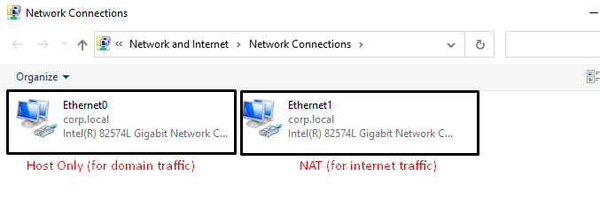
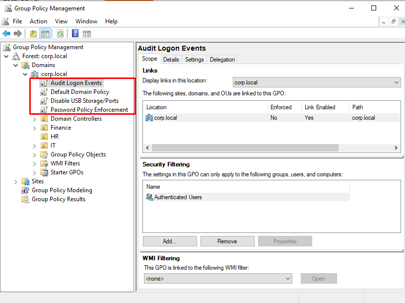
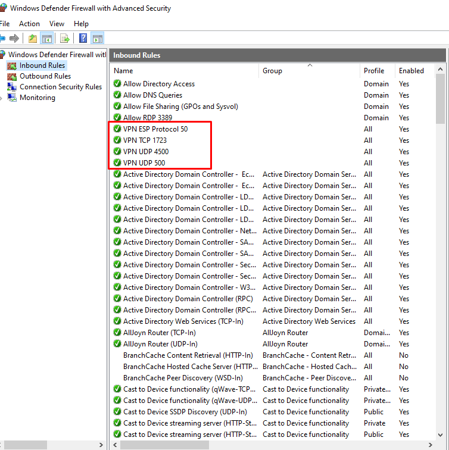
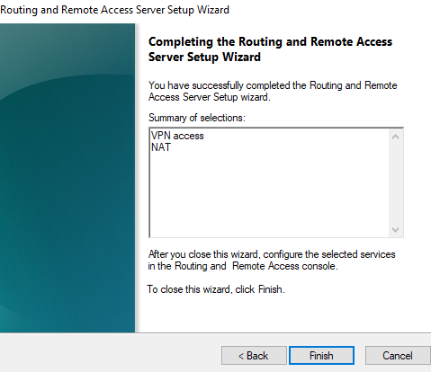
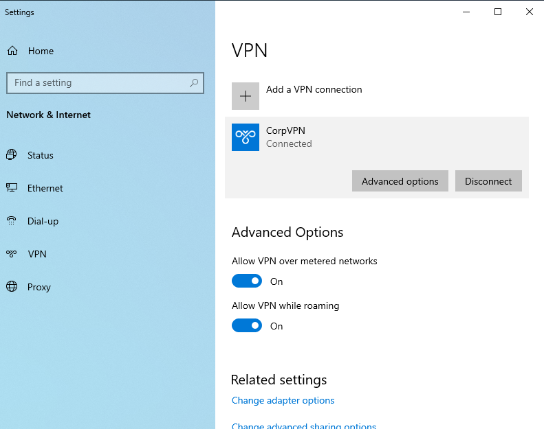
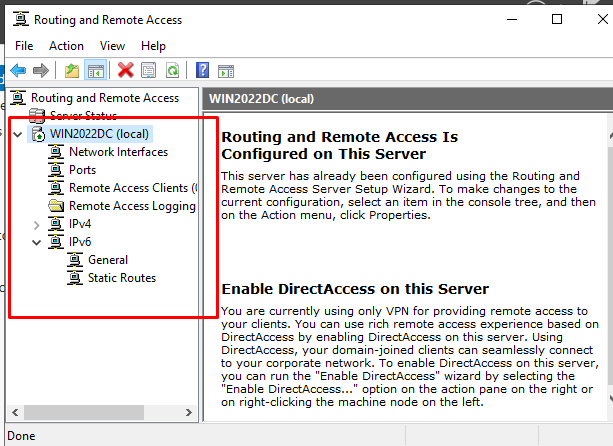
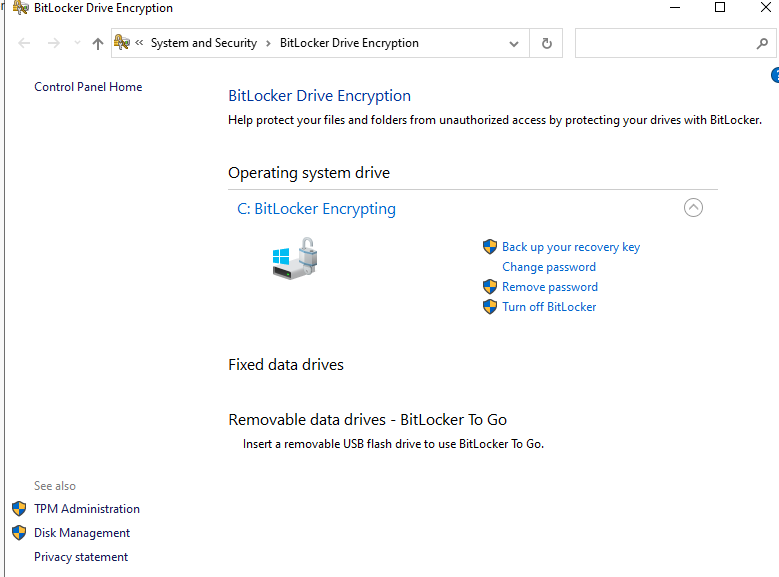
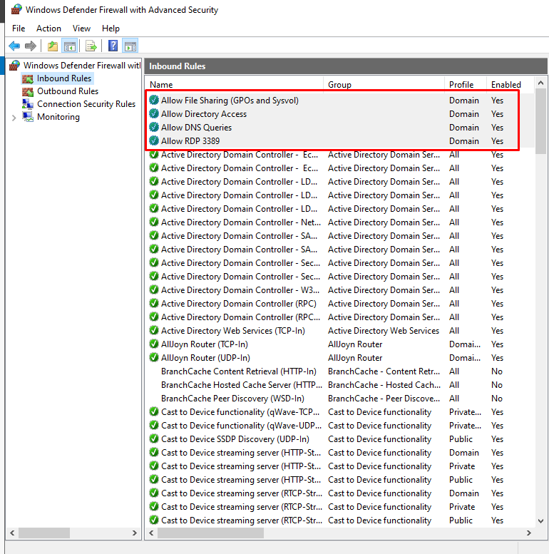
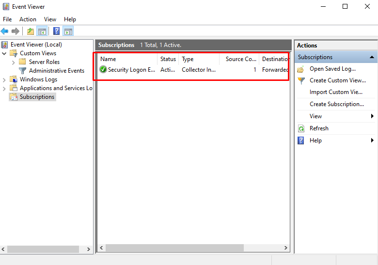
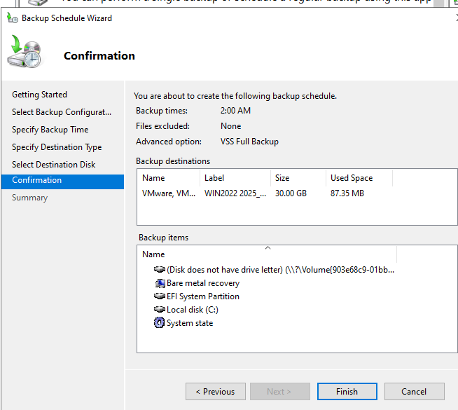

# Enterprise Windows Server 2022 IT Infrastructure Lab - Active Directory, VPN, GPO, Security Hardening

## Overview
This project simulates a real-world corporate IT environment built on **Windows Server 2022**. It demonstrates how to design and configure essential IT infrastructure services, including:
- **Active Directory Domain Services (AD DS)**
- **DNS** and **DHCP**
- **Group Policy Objects (GPOs)**
- **L2TP/IPSec VPN Server**
- **BitLocker Drive Encryption**
- **Centralized Event Log Collection (Windows Event Forwarding)**
- **Windows Server Backup**
- **PowerShell Automation**

Designed as a home lab to develop and demonstrate **IT System Administration**, **Infrastructure Management**, and **Security Hardening** skills.

---

## Technologies Used
- Windows Server 2022 (Evaluation Edition)
- Windows 10 Client (Evaluation Edition)
- VMware Workstation Pro (or VirtualBox)
- Active Directory Domain Services (AD DS)
- DNS and DHCP Services
- Group Policy Management Console (GPMC)
- Routing and Remote Access Service (RRAS) for VPN
- BitLocker Drive Encryption
- Windows Event Forwarding (WEF)
- Windows Server Backup
- PowerShell

---

## Lab Architecture
- **Domain Name**: `corp.local`
- **Static IP for Domain Controller**: `192.XXX.XX.XX`
- **DHCP Scope**: `192.XXX.XX.XXX - 192.XXX.XX.XXX`
- **VPN**: L2TP/IPSec (Pre-shared key based)
- **Network Segregation**: Host-Only network for domain traffic + NAT for internet access



---

## Features Implemented
### 1. Active Directory Domain Services (AD DS)
- Created a domain `corp.local`.
- Built Organizational Units (OUs) for `Users` and `Computers`.
- Created multiple user accounts and computer accounts.



---

### 2. Group Policy Objects (GPOs)
- Enforced **password complexity** and **expiration policies**.
- **Blocked USB devices** via GPO for enhanced security.
- **Audited logon events** via security settings.

---

### 3. VPN Setup (L2TP/IPSec)
- Configured a VPN server using RRAS.
- Enabled L2TP/IPSec with pre-shared key for secure remote access.
- Configured Windows Firewall to allow VPN ports.



- Successfully created the VPN server:



- Successfully connected to VPN:



- Routing and Remote Access Setup:



---

### 4. Security Hardening
- Enabled **BitLocker** encryption on the server OS drive.
- Configured **Account Lockout Policies** to prevent brute-force attacks.
- Configured Firewall Rules (File Share, DNS, RDP).





---

### 5. Centralized Event Log Collection (WEF)
- Set up Windows Event Forwarding.
- Configured the domain controller as a collector.
- Forwarded logs from the client to the server.



---

### 6. Scheduled Backup
- Installed Windows Server Backup.
- Configured regular backups to ensure disaster recovery readiness.



---

### 7. PowerShell Automation
- **Create-BulkUsers.ps1**: Script to bulk-create 50 Active Directory users.
- **Find-LockedOutUsers.ps1**: Script to list all locked-out AD accounts.

---

## Files Included
| File | Description |
|---|---|
| `Create-BulkUsers.ps1` | PowerShell script to bulk-create 50 users. |
| `Find-LockedOutUsers.ps1` | PowerShell script to find locked-out users. |
| `Host-Only-Domain-with-NAT-Internet.png` | Lab network architecture diagram. |
| `gpo-configuration.png` | Screenshot showing Group Policies applied. |
| `vpn-connection.png` | Screenshot of VPN connection established. |
| `firewall-fileshare-da-dns-rdp.png` | Firewall rules (File Share, DNS, RDP). |
| `firewall-vpn-ports.png` | Firewall rules (VPN ports). |
| `bitlocker-enabled.png` | Screenshot of BitLocker enabled. |
| `WEF-event-viewer-created.png` | Screenshot of centralized log collection. |
| `windows-server-backup.png` | Screenshot of scheduled backup configuration. |
| `1.LAB-FULL-WORKFLOW(with screenshots).pdf` | Full lab setup documentation and walkthrough. |

---

## Lab Report
A full detailed report of the lab setup steps, screenshots, and configurations is available [here](1.LAB-FULL-WORKFLOW(with%20screenshots).pdf).

---

## How to Run the PowerShell Scripts
1. Open **Windows PowerShell as Administrator**.
2. Set execution policy:
   ```
   Set-ExecutionPolicy RemoteSigned -Scope Process
   ```
3. Run:
   ```
   .\Create-BulkUsers.ps1
   ```
4. To find locked out users:
   ```
   .\Find-LockedOutUsers.ps1
   ```

---

## Key Skills Demonstrated
- IT System Administration
- Infrastructure Design & Deployment
- Active Directory and Group Policy Management
- Secure Remote Access (VPN)
- Security Hardening (BitLocker, Account Lockout Policies, Firewall Configuration)
- Centralized Monitoring (Event Forwarding)
- Disaster Recovery Planning (Backup Solutions)
- PowerShell Scripting & Automation

---

## Author
**Brennan Tong**  
